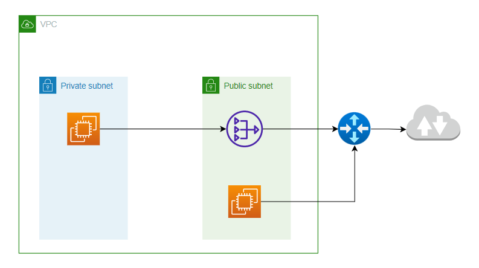
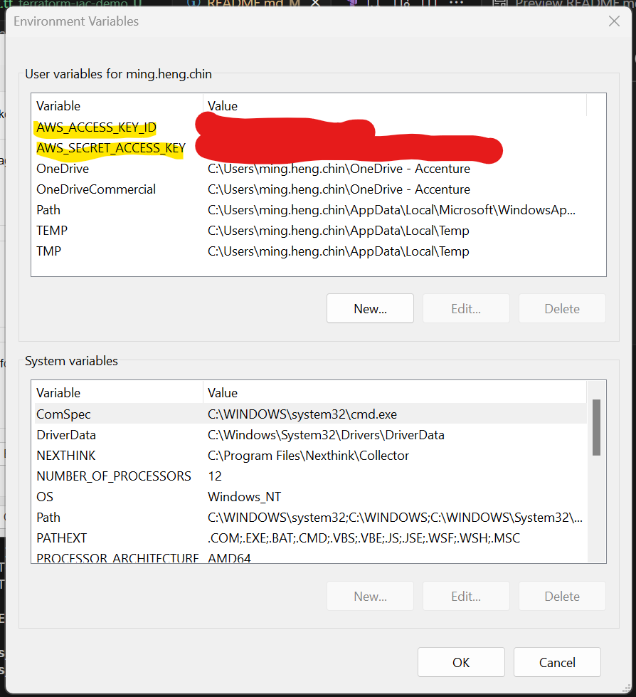

# Introduction
In this demo, the following infrastructure will be created.


# How to start the demo
Please ensure your test machine have the following pre-requisite:
1. Git clone this repository to your test machine.
2. Ensure Terraform CLI tool is installed. Please refer to this [documentation](https://developer.hashicorp.com/terraform/tutorials/aws-get-started/install-cli)
3. Ensure AWS access key id and secret key is created with **Right Permission**. Please refer to this [documentation](https://docs.aws.amazon.com/powershell/latest/userguide/pstools-appendix-sign-up.html)
4. Create a S3 bucket with a new unique name, this is to store terraform statefile.

Once the pre-requisite item is ready, you may follow the following steps to setup the demo:
1. Git clone this repository to the test machine.
2. Ensure the AWS access key id and secret key is setup as environment variable. Here is the sample in Windows Machine:

3. Update the s3 bucket name in provider.tf line 16 with the name created in pre-requisite item 4.
4. Once this is done, you may execute the following command:
```
terraform init
terraform plan
terraform apply -auto-approve
```
5. When execute terraform plan, you shall see the following output at the end:
```
Plan: 23 to add, 0 to change, 0 to destroy.
```
6. Once complete terraform apply, you may check your AWS account for the resources.

# How to test the connectivity for public ec2
1. Please download the acntfdemo-key.pem.
2. Follow the instruction given in AWS EC2 portal to connect via ssh.

# How to test the connectivity for private ec2
1. Ensure you are connected public ec2, because in this demo, the connection to private ec2 only can be connected from public ec2. 
2. Create a private key name acntfdemo-key.pem. Copy and paste from the downloaded key.
3. Once the private key is created, follow the instruction given in AWS EC2 portal to connect via ssh.

# How to decommission the resources created
1. After the demo is completed, do remember to decommision the resources created via the following command:
```
terraform destroy
```
2. You shall see the following output at the end:
```
Plan: 0 to add, 0 to change, 23 to destroy.
```
3. Do remember to verify the resources in AWS console.
4. Lastly do remember to revoke the access key id and secret key, and also delete the s3 bucket.